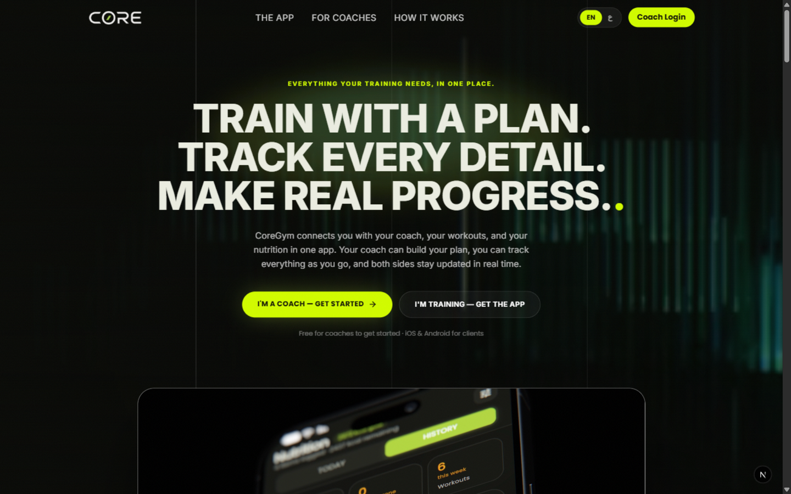
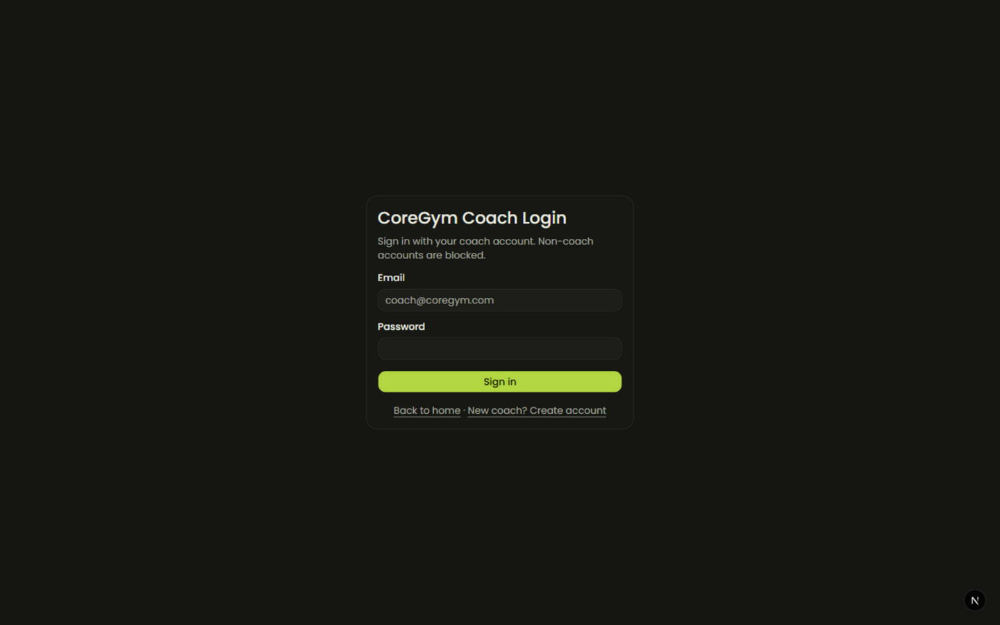
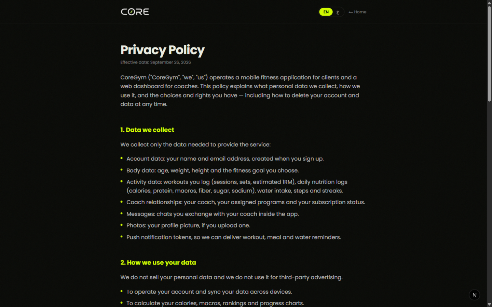
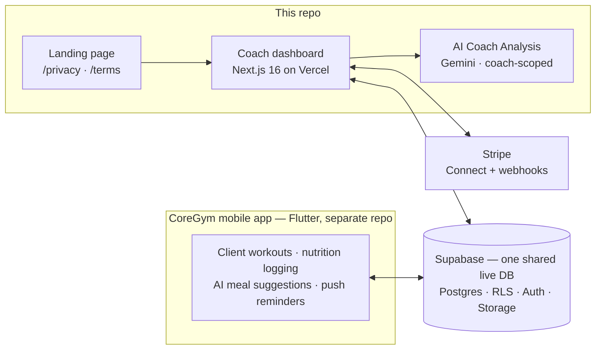

# CoreGym Coach Dashboard

[](https://github.com/alimohammedassi/core_dashboard/actions/workflows/ci.yml)
[](https://coregym-coach-dashboard-orpin.vercel.app)

The coach-facing web platform for the **CoreGym** fitness product — a Next.js 16
dashboard where coaches manage clients, build workout and nutrition programs,
review performance set-by-set, chat in realtime, get paid through Stripe, and
generate **AI-powered client analyses**. Clients train in the
[CoreGym Flutter mobile app](https://github.com/alimohammedassi/coregymali)
against the **same live Supabase database** — what a client logs in the gym
shows up here automatically, and what a coach prescribes here appears on the
client's phone.

**Live:** https://coregym-coach-dashboard-orpin.vercel.app ·
**Deep dive:** [`coregym-coach-dashboard/README.md`](coregym-coach-dashboard/README.md)

---

## Screenshots

| | |
| --- | --- |
|  |  |
| **Bilingual landing (EN/AR)** — marketing site with language toggle | **Coach login** — email/password + Google OAuth, non-coach accounts blocked |
|  | |
| **Privacy Policy & Terms** — full legal pages at `/privacy` and `/terms`, EN/AR | |

## How the ecosystem fits together



One database, two surfaces. The dashboard **never writes mobile-side data**
(free logging, AI features), and the mobile app **never changes** for dashboard
features — the contract between them is the shared schema plus the
`workout_sessions.assignment_id` / enrollment links documented in
[`docs/mobile-assignment-linking.md`](coregym-coach-dashboard/docs/mobile-assignment-linking.md).

## What coaches can do

<details open>
<summary><b>AI Coach Analysis</b> — one-click, coach-scoped client insights</summary>

From any subscriber profile, a coach can generate an AI analysis of the
client's training and nutrition trajectory. The endpoint enforces the full
authorization chain before anything runs — session → coach identity →
coach-owned subscription (a foreign id is indistinguishable from a missing
one) → per-coach rate limit — then assembles a strictly **bounded data
bundle** (capped windows on assignments, sessions, records, volume and
adherence; free-text fields excluded as an injection surface), validates the
model output against a strict contract with one repair retry, screens for
prompt-injection artifacts, and returns JSON marked `no-store`. Results are
**never persisted** — every analysis is computed fresh from live data.

</details>

<details>
<summary><b>Workout management loop</b> — prescribe, review, adjust</summary>

Build a reusable workout **template** (target muscles, exercises with
sets/reps/weight/rest, autocomplete from the shared `exercises` catalog),
assign it to any active subscriber for any date, then review the client's
logged performance **set-by-set** — target vs actual, best weight, volume,
completion, warmup separation. Send feedback straight into the existing chat
and use **Duplicate as Next Workout** to schedule the adjusted session.

</details>

<details>
<summary><b>Coach weekly programs</b> — multi-week scheduling</summary>

Group templates into a weekly schedule (Mon/Wed/Fri style), enroll a client
for a fixed duration, and every assignment is generated atomically. A
weeks×days progress grid tracks delivery, and **Update Remaining Weeks**
regenerates future work without ever touching client history.

</details>

<details>
<summary><b>Nutrition programs</b> — meal planning from the shared foods library</summary>

Mirror of the weekly-programs architecture for food: group items from the
global `foods` catalog into meals, meals into weekday rows, weekday rows into a
reusable weekly nutrition program, and enroll a client for N weeks — every
prescribed meal row is materialized in one atomic operation. The client sees
and completes the plan in the mobile app; coach-side edits are tracked in a
change log. Deliberately separate from the app's free-logging tables.

</details>

<details>
<summary><b>Clients, revenue & chat</b></summary>

Overview stats, rich subscriber profiles, plan management, revenue view,
subscribers CSV export, and realtime chat reusing the mobile app's conversation
tables — with full media parity (images, voice notes, files) via private
buckets and participant-gated signed URLs.

</details>

<details>
<summary><b>Landing & legal</b> — the public face</summary>

A bilingual (English/Arabic, persisted toggle) marketing landing page with
coach signup/login entry points, plus full **Privacy Policy** and **Terms of
Service** pages (`/privacy`, `/terms`) required for Google Play submission of
the mobile app — both switch language with the same toggle.

</details>

## Stack

| Layer | Choice |
| --- | --- |
| Framework | Next.js 16 (App Router, Turbopack) + React 19 + TypeScript |
| Styling | Tailwind CSS 4, shadcn/base-ui, "Graphite & Soft Volt" theme (dark default, Poppins/Cairo) |
| Database | Supabase (Postgres 17 + RLS + SECURITY DEFINER RPCs) — shared with the mobile app |
| Auth | Supabase Auth — email/password + Google OAuth (PKCE via middleware), coach-gated |
| AI | Google Gemini — coach-scoped analysis with bounded payloads and contract validation |
| Payments | Stripe — Connect onboarding, checkout, webhooks |
| Hosting | Vercel · CI via GitHub Actions · 158+ unit tests (`node --test`) |

## Repo layout

```
core_dashboard/
├── coregym-coach-dashboard/   ← the app — start with its README
│   ├── src/app/               routes: (auth) · (dashboard) · landing · /privacy · /terms
│   ├── src/app/api/           31 server routes (workouts, nutrition, chat, foods, AI, Stripe…)
│   ├── src/lib/ai/            AI analysis flow: collector, payload bounds, contract, provider
│   ├── src/components/        landing/, dashboard UI, shadcn/base-ui primitives
│   ├── supabase/              SQL migrations + prepared remediation runbook (idempotent)
│   ├── tests/                 node --test unit tests (auth chains, payload bounds, contracts)
│   └── docs/                  workflow, summaries, performance & load-test reports
└── rollback/                  historical snapshot only — see security note
```

## Security posture

- **Defense in depth:** every server route re-validates the session JWT and
  derives coach identity server-side; sensitive writes run through SECURITY
  DEFINER RPCs that re-verify ownership inside the database; RLS is enabled on
  every table. Cross-tenant identifiers are indistinguishable from missing ones.
- **Hardened surfaces:** AI analysis (auth → ownership → rate limit → bounded
  payload → contract validation → injection screening), exports (paged,
  formula-neutralized CSV), uploads (content sniffing, active-content
  blocking, attachment-forced downloads), auth (session revocation on password
  change, no cookie-driven role changes), Stripe Connect (coach-gated).
- **Operated:** `/api/health` exposes component status; structured `no-store`
  semantics on any response containing client data; 65+ security-focused unit
  tests in CI.
- ⚠️ The `rollback/` folder previously held real credentials that entered git
  history (removed from tracking in `cdde65a`); rotation was mandated and is
  tracked in the private docs — never commit env files.

## Getting started

Full setup, the environment-variable table, migration status and testing
commands live in
[`coregym-coach-dashboard/README.md`](coregym-coach-dashboard/README.md).
Short version:

```bash
cd coregym-coach-dashboard
npm install
cp .env.example .env.local   # Supabase + Gemini + Stripe keys — never commit real values
npm test                     # 158+ unit tests
npm run dev                  # http://localhost:3000
```

## Docs index

| Doc | What it covers |
| --- | --- |
| [App README](coregym-coach-dashboard/README.md) | Setup, env vars, migrations, RLS architecture, deployment |
| [product-workflow.md](coregym-coach-dashboard/docs/product-workflow.md) | The complete product/user workflow — start here |
| [PROJECT_SUMMARY.md](coregym-coach-dashboard/docs/PROJECT_SUMMARY.md) | Feature & status summary |
| [coach-weekly-programs.md](coregym-coach-dashboard/docs/coach-weekly-programs.md) | Weekly programs deep dive |
| [mobile-assignment-linking.md](coregym-coach-dashboard/docs/mobile-assignment-linking.md) | Contract with the Flutter app |
| [performance-audit.md](coregym-coach-dashboard/docs/performance-audit.md) · [load-test-report.md](coregym-coach-dashboard/docs/load-test-report.md) | Performance record (50-client load test) |

---

*The coach prescribes. The client performs. The data connects.*
